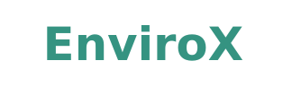

The Envirox is a multi-faceted platform designed to promote sustainability and awareness regarding energy consumption, product sustainability, and waste management. Our tools leverage the power of data analytics, natural language processing, and computer vision to provide users with actionable insights to make more eco-friendly decisions.

## Features

1. **Energy Consumption Analysis (Data Analytics):**
   Using big data analytics, this feature provides users with a personalized dashboard which identifies patterns, pinpoints inefficiencies, and encourages energy-saving habits.

2. **Amazon Product Sustainability Score (NLP+LLM):**
   
3. **Brand Sustainability Profiles (LLM, Web Scraping):**
   Utilizing advanced LLM capabilities, this feature compiles data on corporate practices obtained via web scraping to offer a concise profile highlighting brand sustainability efforts.

4. **Waste Classification Guide (Computer Vision, CNN, TensorflowJs):**
   A user-friendly guide that incorporates a custom-trained Convolutional Neural Network (CNN) to identify and sort waste. It promulgates correct waste disposal procedures, assisting users in contributing to environmental conservation.

## Tech Stack

-   HTML5
-   CSS3
-   JavaScript
-   Python
-   Streamlit
-   TensorFlow.js
-   Pandas
-   NumPy
-   Matplotlib
-   Gemini

## Quick Links

-   [Live Website](https://envirox.netlify.app/)
-   [Main GitHub Repository](https://github.com/abd766/ENVIROX)
-   [Project Demo Video](https://drive.google.com/file/d/19tAMR7pSu55lUmvklqvcrZNQkfZNoHot/view?usp=sharing)

## Project Demo

[EnviroX](https://drive.google.com/file/d/19tAMR7pSu55lUmvklqvcrZNQkfZNoHot/view?usp=sharing)

---
